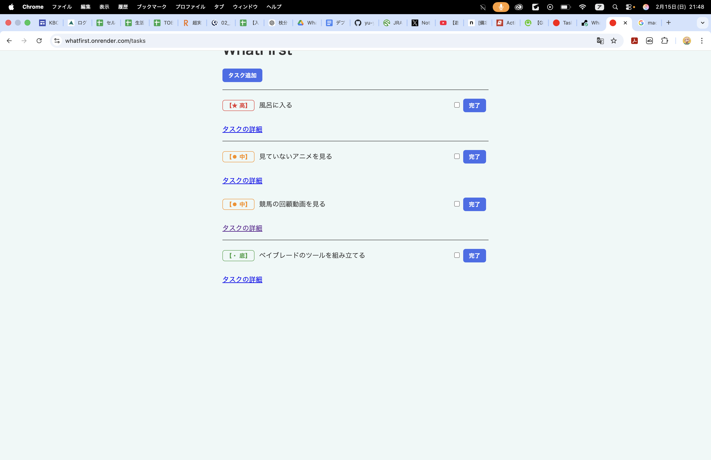

# WhatFirst

優先順位付きTo‑Do管理アプリ

---

## Demo

[https://whatfirst.onrender.com/tasks](https://whatfirst.onrender.com/tasks)


---

## スクリーンショット



---

## サービス概要

就労移行支援で「タスクの優先順位付けが難しい」と感じた経験から、
優先度ベースでタスクを整理できるアプリを開発しました。

シンプルな操作で

* タスク作成
* 完了チェック
* 優先順位管理
  ができるようにしています。

---

## 使用技術

* Ruby 3.x
* Ruby on Rails 8.x
* PostgreSQL
* Render（デプロイ）
* Rails Test
* Git / GitHub

---

## 技術的なポイント

* PostgreSQLへの移行
* Renderでの本番デプロイ
* 環境変数による設定管理
* database.ymlのproduction設定対応

※ 本番環境は Render 上で PostgreSQL と接続し、  
   環境変数によって本番用設定を切り替えています。

---

## 主な機能

* タスクの作成・編集・削除
* 完了チェック
* 優先順位設定
* 本番環境へのデプロイ

---

## 工夫した点

* 優先順位で自動ソートされるように実装
* MVPとして機能を最小限に絞り、迷わないUIを設計
* Renderで本番デプロイし、環境差異の問題を解決

---

## 制作背景

私は約10年間、事務職としてデータ整理やタスク管理を行ってきましたが、
優先順位の判断に悩むことが多くありました。

また、就労移行支援でも同様の課題を感じ、
自分の困りごとを解決するためにこのアプリを開発しました。

---

## 今後の改善予定

* 優先順位の自動提案
* 通知機能
* UI改善
* ユーザー認証

---

## 開発環境

```bash
bundle install
rails db:create db:migrate
rails s
```

---

## 作者

永野 裕也  
ITエンジニア転職を目指して学習中。  


---

## 他の制作物

* Java + Swing で PomodoroTimer を開発
  → 実行ファイル化、GitHub公開済み  
( https://github.com/yu-ya0117/PomodoroTimer )

---

※ credentials.yml.enc は暗号化されており、master.key はGitHubに含まれていません。
